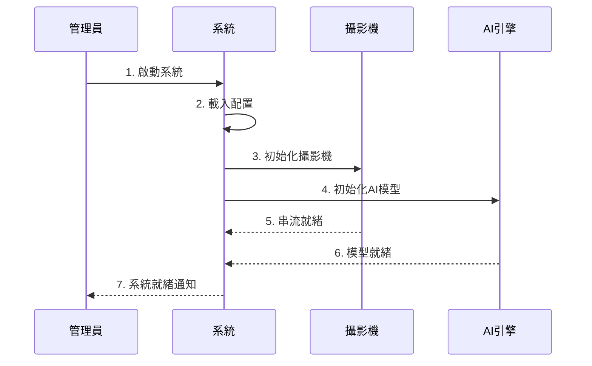
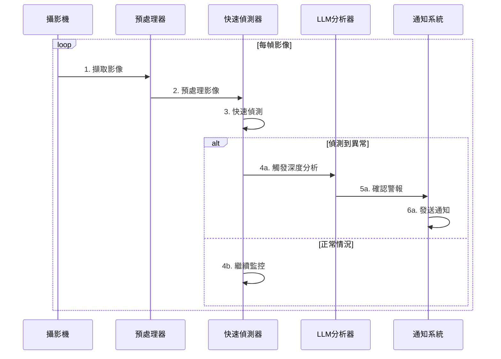
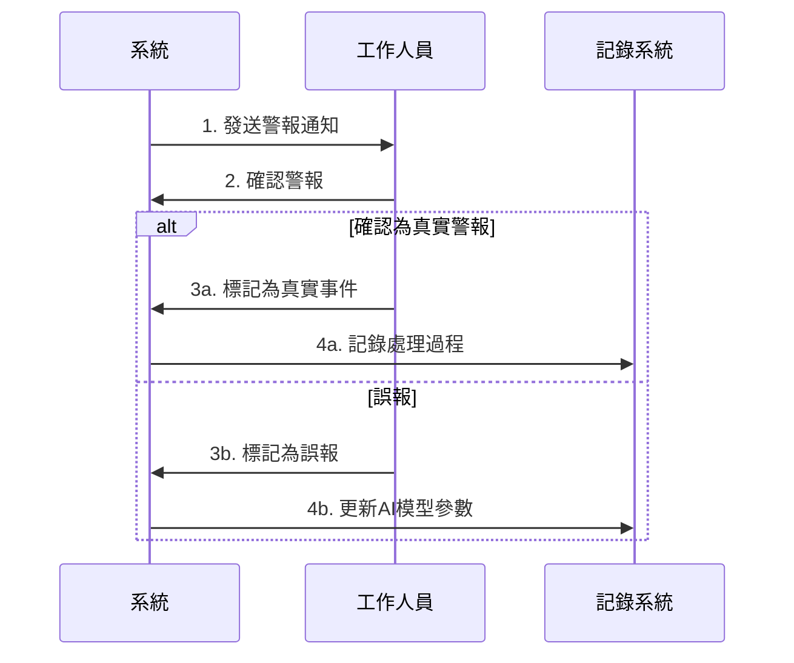

# 智眼警示系統 - 系統運作流程與使用者流程分析

## 1. 系統運作流程

### 1.1 系統啟動流程



### 1.2 即時監控流程



### 1.3 警報處理流程



## 2. 使用者流程分析

### 2.1 系統管理員流程

#### 初始設定階段

1. **系統部署**

   - 安裝 Docker 環境
   - 執行部署腳本
   - 設定系統參數

2. **攝影機設定**

   - 新增攝影機
   - 設定監控區域
   - 調整攝影機參數

3. **警報規則配置**
   - 設定警報條件
   - 配置通知對象
   - 定義升級流程

#### 日常維護階段

1. **系統監控**

   - 查看系統狀態
   - 監控資源使用
   - 檢查連線狀況

2. **效能調整**
   - 分析系統日誌
   - 優化偵測參數
   - 調整資源配置

### 2.2 一線工作人員流程

#### 日常監控

1. **系統登入**

   ```
   首頁
   └── 登入頁面
       └── 儀表板
   ```

2. **即時監控**
   - 查看即時影像
   - 監控警報狀態
   - 接收系統通知

#### 警報處理

1. **接收警報**

   - LINE 通知
   - Email 通知
   - 系統內通知

2. **事件處理**

   - 確認警報內容
   - 查看現場狀況
   - 採取應對措施

3. **結果回饋**
   - 記錄處理過程
   - 標記警報類型
   - 提供改善建議

### 2.3 使用者介面流程

#### 主要頁面結構

```
首頁
├── 儀表板
│   ├── 即時監控
│   ├── 警報概況
│   └── 系統狀態
├── 歷史記錄
│   ├── 事件列表
│   ├── 統計分析
│   └── 報表匯出
└── 設定
    ├── 攝影機管理
    ├── 警報規則
    └── 系統設定
```

#### 功能操作流程

1. **即時監控**

   ```
   儀表板
   └── 即時監控
       ├── 選擇攝影機
       ├── 調整視角
       └── 查看狀態
   ```

2. **警報處理**
   ```
   警報通知
   └── 警報詳情
       ├── 確認狀況
       ├── 處理回報
       └── 關閉警報
   ```

## 3. 特殊情境處理

### 3.1 系統異常處理

1. **網路中斷**

   - 本地緩存啟動
   - 自動重連機制
   - 離線警報存儲

2. **設備故障**
   - 自動切換備用
   - 故障通知
   - 降級服務模式

### 3.2 緊急情況處理

1. **高風險事件**

   - 即時升級通知
   - 自動通報機制
   - 緊急聯絡流程

2. **系統過載**
   - 負載平衡
   - 優先級處理
   - 資源動態調配

## 4. 效能與可用性

### 4.1 回應時間要求

- 即時影像延遲 < 500ms
- 警報觸發延遲 < 1s
- 通知送達時間 < 3s

### 4.2 系統可用性

- 系統運行時間 > 99.9%
- 自動故障轉移時間 < 30s
- 資料備份恢復時間 < 1h

## 5. 持續改進機制

### 5.1 資料收集

- 使用者操作日誌
- 系統效能指標
- 警報準確度統計

### 5.2 優化流程

1. **定期分析**

   - 效能瓶頸識別
   - 使用者回饋整理
   - 系統問題歸納

2. **改進實施**
   - 參數微調
   - 功能優化
   - 流程改善
