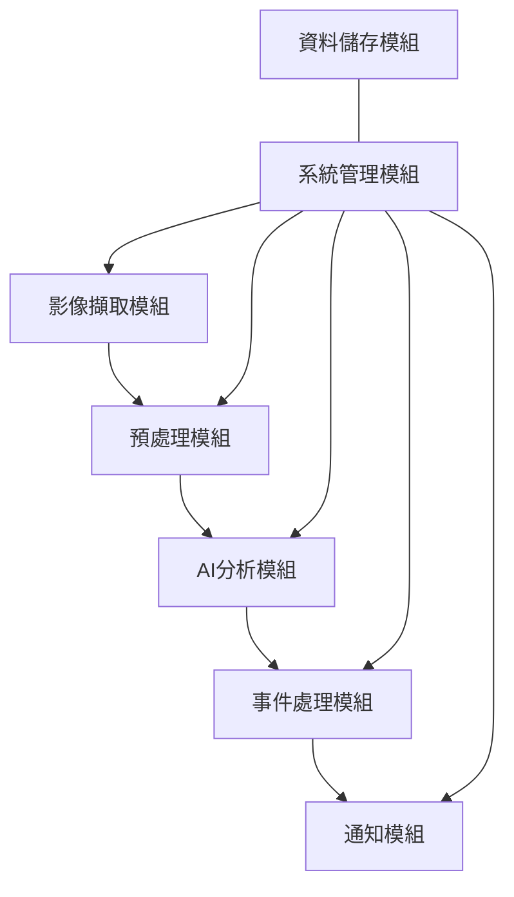
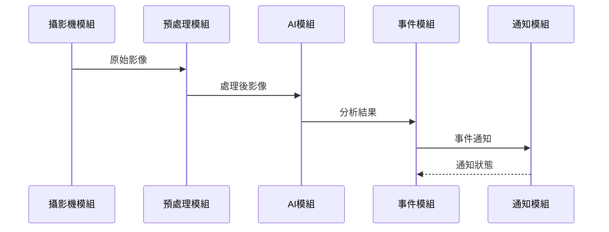

# 智眼警示系統 - 系統模組分析

## 1. 核心模組概覽

### 1.1 模組架構圖



### 1.2 模組職責矩陣

| 模組名稱 | 主要職責       | 次要職責     | 相依模組 |
| -------- | -------------- | ------------ | -------- |
| 影像擷取 | 攝影機串流處理 | 影像品質監控 | 系統管理 |
| 預處理   | 影像正規化     | 效能優化     | 影像擷取 |
| AI 分析  | 異常偵測       | 模型優化     | 預處理   |
| 事件處理 | 警報管理       | 事件紀錄     | AI 分析  |
| 通知     | 警報發送       | 訊息追蹤     | 事件處理 |
| 系統管理 | 整體協調       | 效能監控     | 全部     |
| 資料儲存 | 資料持久化     | 資料分析     | 系統管理 |

## 2. 模組詳細分析

### 2.1 影像擷取模組

#### 2.1.1 核心功能

```python
class CameraModule:
    def __init__(self):
        self.cameras = {}
        self.stream_manager = StreamManager()

    async def add_camera(self, camera_config: CameraConfig):
        # 新增攝影機
        pass

    async def get_frame(self, camera_id: str) -> Frame:
        # 獲取影像幀
        pass

    def monitor_quality(self):
        # 監控影像品質
        pass
```

#### 2.1.2 介面定義

```python
class ICameraModule(Protocol):
    async def start_stream(self): ...
    async def stop_stream(self): ...
    async def get_frame(self) -> Frame: ...
    def get_status(self) -> CameraStatus: ...
```

#### 2.1.3 效能指標

- 影像擷取延遲 < 50ms
- 影像品質監控間隔: 5s
- 最大支援攝影機數: 16

### 2.2 預處理模組

#### 2.2.1 核心功能

```python
class PreprocessorModule:
    def __init__(self):
        self.processors = []
        self.cache = FrameCache()

    async def process_frame(self, frame: Frame) -> ProcessedFrame:
        # 影像預處理邏輯
        pass

    def add_processor(self, processor: ImageProcessor):
        # 新增處理器
        pass
```

#### 2.2.2 處理流程

1. 影像降噪
2. 尺寸調整
3. 光線補償
4. 動態區域檢測

### 2.3 AI 分析模組

#### 2.3.1 分析引擎

```python
class AIEngine:
    def __init__(self):
        self.quick_detector = MediaPipeDetector()
        self.llm_analyzer = LLMAnalyzer()

    async def analyze_frame(self, frame: ProcessedFrame) -> AnalysisResult:
        # 快速檢測
        quick_result = self.quick_detector.detect(frame)

        if quick_result.requires_deep_analysis:
            # LLM 深度分析
            llm_result = await self.llm_analyzer.analyze(quick_result)
            return self.merge_results(quick_result, llm_result)

        return quick_result
```

#### 2.3.2 模型管理

```python
class ModelManager:
    def __init__(self):
        self.models = {}
        self.metrics = ModelMetrics()

    async def load_model(self, model_id: str):
        # 載入模型
        pass

    def update_model(self, model_id: str, metrics: dict):
        # 更新模型
        pass
```

### 2.4 事件處理模組

#### 2.4.1 事件分類

```python
class EventProcessor:
    def __init__(self):
        self.handlers = {}
        self.event_queue = EventQueue()

    async def process_event(self, event: Event):
        # 事件處理邏輯
        handler = self.handlers.get(event.type)
        if handler:
            await handler.handle(event)
```

#### 2.4.2 警報等級

1. 緊急警報（需立即處理）
2. 重要警報（需儘快處理）
3. 一般警報（需定期檢查）
4. 資訊通知（僅供參考）

### 2.5 通知模組

#### 2.5.1 通知管理

```python
class NotificationManager:
    def __init__(self):
        self.channels = {
            'line': LineNotifier(),
            'email': EmailNotifier(),
            'system': SystemNotifier()
        }

    async def send_notification(self,
                              message: str,
                              level: NotificationLevel,
                              channels: List[str]):
        for channel in channels:
            await self.channels[channel].send(message, level)
```

#### 2.5.2 通知策略

- 緊急警報：全通道通知
- 重要警報：主要通道通知
- 一般警報：選擇性通知
- 資訊通知：系統內通知

### 2.6 系統管理模組

#### 2.6.1 配置管理

```python
class ConfigManager:
    def __init__(self):
        self.configs = {}
        self.validators = {}

    def update_config(self, module: str, config: dict):
        # 更新配置
        if self.validate_config(module, config):
            self.configs[module] = config
            self.apply_config(module)
```

#### 2.6.2 資源監控

- CPU 使用率監控
- 記憶體使用監控
- 網路流量監控
- 儲存空間監控

### 2.7 資料儲存模組

#### 2.7.1 資料模型

```python
class DataModel:
    class Event(BaseModel):
        id: str
        timestamp: datetime
        type: EventType
        details: dict
        status: EventStatus

    class Alert(BaseModel):
        id: str
        event_id: str
        level: AlertLevel
        status: AlertStatus
        handled_by: Optional[str]
```

#### 2.7.2 儲存策略

- 即時事件：記憶體快取
- 重要記錄：本地資料庫
- 歷史資料：定期歸檔

## 3. 模組間通訊

### 3.1 通訊方式

1. 同步呼叫：直接函式調用
2. 非同步事件：事件佇列
3. 訊息佇列：Redis
4. WebSocket：即時通訊

### 3.2 資料流向



## 4. 擴展性設計

### 4.1 插件系統

```python
class PluginManager:
    def __init__(self):
        self.plugins = {}

    def register_plugin(self, plugin: Plugin):
        # 註冊插件
        pass

    def load_plugins(self):
        # 載入插件
        pass
```

### 4.2 自定義擴展點

1. 自定義偵測器
2. 自定義通知渠道
3. 自定義資料處理器
4. 自定義報表產生器

## 5. 效能優化

### 5.1 快取策略

- 影像幀快取
- 分析結果快取
- 配置快取
- API 響應快取

### 5.2 併發處理

- 影像處理平行化
- 事件處理非同步化
- 通知發送非阻塞
- 資料處理批次化

## 6. 硬體整合方案

### 6.1 支援硬體規格

#### 6.1.1 網路攝影機需求

```yaml
基本需求：
- 解析度：至少 1080p (1920x1080)
- 幀率：至少 15fps
- 網路介面：乙太網路或 Wi-Fi
- 協議支援：RTSP/ONVIF
- 夜視功能：紅外線夜視（建議）

推薦規格：
- 解析度：2K (2560x1440)
- 幀率：30fps
- 視角：110度以上
- 雙向語音：選配
- 移動偵測：硬體支援
```

#### 6.1.2 建議攝影機型號

1. **入門級別**

   - 小米攝影機 2K
   - TP-Link Tapo C200
   - 羅技 C920x

2. **專業級別**
   - AXIS M1065-L
   - Hikvision DS-2CD2143G0-I
   - Dahua IPC-HDW2431T-AS

### 6.2 整合方式

#### 6.2.1 標準整合流程

```python
class CameraIntegration:
    def __init__(self):
        self.supported_protocols = ['rtsp', 'onvif', 'http']
        self.stream_handlers = {
            'rtsp': RTSPHandler(),
            'onvif': ONVIFHandler(),
            'http': HTTPHandler()
        }

    async def connect_camera(self, camera_config: dict):
        # 1. 驗證攝影機連線資訊
        protocol = self.detect_protocol(camera_config)

        # 2. 建立串流連線
        handler = self.stream_handlers[protocol]
        stream = await handler.connect(camera_config)

        # 3. 檢查串流品質
        if await self.validate_stream(stream):
            return stream

        raise ConnectionError("串流品質不符合要求")
```

#### 6.2.2 支援的串流協議

1. **RTSP（主要支援）**

   ```python
   rtsp_url = f"rtsp://{username}:{password}@{ip}:{port}/{stream_path}"
   ```

2. **ONVIF（企業級）**

   ```python
   onvif_config = {
       'ip': camera_ip,
       'port': 80,
       'user': username,
       'password': password,
       'wsdl': './wsdl'
   }
   ```

3. **HTTP（備用方案）**
   ```python
   http_stream = f"http://{ip}:{port}/video_feed"
   ```

### 6.3 硬體採購方案

#### 6.3.1 自備硬體方案

```yaml
優點：
- 降低初期成本
- 善用既有設備
- 彈性選擇硬體

要求：
- 符合基本規格要求
- 支援標準串流協議
- 可存取設備管理介面

建議：
- 提供相容性檢查工具
- 協助設備設定教學
- 提供技術支援服務
```

#### 6.3.2 整合採購方案

```yaml
基礎套裝：
- 2MP 網路攝影機 × 1
- PoE 供電器 × 1
- 安裝支架與線材
- 價格：NT$ 5,000

進階套裝：
- 4MP 網路攝影機 × 1
- PoE 交換器 4埠
- 專業安裝支架
- 價格：NT$ 8,000

企業套裝：
- 4MP 網路攝影機 × 4
- PoE 交換器 8埠
- NVR 儲存設備
- 價格：NT$ 25,000
```

### 6.4 安裝與設定流程

#### 6.4.1 自備硬體流程

1. **前置檢查**

   - 下載相容性檢查工具
   - 確認網路環境
   - 驗證攝影機規格

2. **設備設定**

   - 設定固定 IP
   - 啟用 RTSP 串流
   - 配置影像參數

3. **系統整合**
   - 輸入設備資訊
   - 測試串流連線
   - 調整影像品質

#### 6.4.2 整合採購流程

1. **場地勘查**

   - 確認安裝位置
   - 評估網路環境
   - 規劃線路配置

2. **專業安裝**

   - 硬體安裝定位
   - 網路配置設定
   - 影像參數調整

3. **系統整合**
   - 自動裝置發現
   - 串流品質優化
   - 功能測試驗收

### 6.5 常見問題處理

#### 6.5.1 連線問題

```python
async def troubleshoot_connection(camera_info):
    # 1. 網路連通性測試
    if not await ping_test(camera_info['ip']):
        return "網路連線失敗"

    # 2. 串流協議檢查
    if not await protocol_test(camera_info):
        return "不支援的串流協議"

    # 3. 效能測試
    if not await performance_test(camera_info):
        return "串流效能不足"
```

#### 6.5.2 效能優化

1. **網路優化**

   - QoS 設定建議
   - 頻寬分配建議
   - 網路架構建議

2. **影像優化**
   - 解析度調整
   - 壓縮參數設定
   - 幀率最佳化
