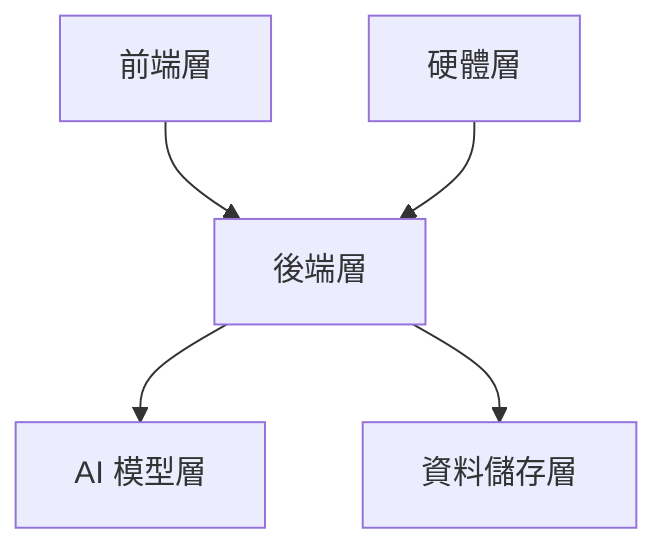

# 智眼警示系統 - 技術棧分析與成本評估報告

## 文件資訊

- 版本：1.0.0
- 更新日期：2024-02-20
- 狀態：規劃評估

## 1. 技術棧概述

### 1.1 整體架構



### 1.2 核心技術選擇

```yaml
前端技術：
- Next.js 14 + React 18
- TypeScript + Tailwind CSS
- WebSocket 即時通訊

後端技術：
- FastAPI (Python)
- SQLite + Redis
- Docker 容器化

AI 技術：
- MediaPipe：姿態估計
- YOLOv8-nano：物件偵測
- GPT-4：場景分析（選配）
```

## 2. 詳細技術棧分析

### 2.1 前端技術棧

#### 2.1.1 核心框架

- **Next.js 14**
  - 使用原因：
    - 開發效率高
    - 內建 API Routes
    - 檔案系統路由
    - 自動效能優化
    - 靜態生成支援

#### 2.1.2 主要依賴

```json
{
  "dependencies": {
    "next": "14.x",
    "react": "18.x",
    "typescript": "5.x",
    "tailwindcss": "3.x",
    "socket.io-client": "4.x",
    "zustand": "4.x"
  }
}
```

#### 2.1.3 前端架構

```
src/
├── app/                # App Router 結構
│   ├── layout.tsx     # 根布局
│   ├── page.tsx       # 首頁
│   ├── dashboard/     # 儀表板
│   └── settings/      # 設定頁面
├── components/         # 共用元件
├── hooks/             # 自定義 Hooks
└── lib/               # 工具函數
```

### 2.2 後端技術棧

#### 2.2.1 核心框架

- **FastAPI**
  - 使用原因：
    - 高效能非同步處理
    - 自動 API 文檔
    - WebSocket 支援
    - 易於整合 AI 模型

#### 2.2.2 主要依賴

```python
# requirements.txt
fastapi==0.104.x
uvicorn==0.24.x
python-multipart==0.0.6
opencv-python==4.8.x
mediapipe==0.10.x
ultralytics==8.x.x
python-socketio==5.x.x
```

#### 2.2.3 後端架構

```
backend/
├── app/
│   ├── api/          # API 端點
│   ├── core/         # 核心邏輯
│   ├── models/       # 資料模型
│   └── services/     # 業務邏輯
├── ml/
│   ├── detectors/    # 偵測器
│   └── processors/   # 影像處理
└── utils/            # 工具函數
```

### 2.3 AI 模型架構

#### 2.3.1 核心模型配置

```yaml
基礎模型：
  MediaPipe:
    用途: 人體姿態估計
    效能: 即時處理
    資源需求: 低

  YOLOv8-nano:
    用途: 物件偵測
    效能: 15-30 FPS
    資源需求: 中等

  GPT-4（選配）:
    用途: 場景理解和分析
    效能: 非即時
    資源需求: API 呼叫
```

#### 2.3.2 AI 運算需求

```yaml
最低配置：
  CPU: 4核心 3.0GHz
  RAM: 8GB
  儲存: 256GB SSD
  GPU: 選配

建議配置：
  CPU: 8核心 3.5GHz
  RAM: 16GB
  儲存: 512GB SSD
  GPU: NVIDIA RTX 2060 或更高
```

## 3. 部署方案

### 3.1 容器化配置

```yaml
# docker-compose.yml
version: "3.8"
services:
  frontend:
    build: ./frontend
    ports:
      - "3000:3000"

  backend:
    build: ./backend
    ports:
      - "8000:8000"
    volumes:
      - ./data:/app/data

  redis:
    image: redis:alpine
    ports:
      - "6379:6379"
```

### 3.2 部署規模方案

#### 3.2.1 小型部署（1-2 攝影機）

```yaml
硬體配置：
- 一般 PC 或 NUC
- 8GB RAM
- 256GB SSD
- 一般網路攝影機

網路需求：
- 上傳頻寬：10Mbps
- 下載頻寬：20Mbps
- 固定 IP
```

#### 3.2.2 中型部署（4-8 攝影機）

```yaml
硬體配置：
- 伺服器等級主機
- 16GB RAM
- 512GB SSD
- GPU 加速卡
- 專業網路攝影機

網路需求：
- 上傳頻寬：50Mbps
- 下載頻寬：100Mbps
- 企業專線
```

#### 3.2.3 大型部署（8+ 攝影機）

```yaml
硬體配置：
- 企業級伺服器
- 32GB RAM
- 1TB SSD
- 專業 GPU
- 高階網路攝影機

網路需求：
- 上傳頻寬：100Mbps+
- 下載頻寬：200Mbps+
- 專屬網路
```

## 4. 成本評估

### 4.1 開發成本

```yaml
人力成本：
前端開發：
人力：1位
時間：1-2個月
成本：NT$ 80,000-160,000

後端開發：
人力：1位
時間：2-3個月
成本：NT$ 160,000-240,000

AI模型調教：
人力：1位
時間：1-2個月
成本：NT$ 100,000-150,000

系統整合：
人力：1位
時間：1個月
成本：NT$ 80,000-120,000

總開發成本：NT$ 420,000-670,000
```

### 4.2 基礎建設成本

```yaml
小型部署（1-2 攝影機）：
硬體設備：NT$ 15,000-20,000
網路攝影機：NT$ 5,000-8,000/台
網路設備：NT$ 3,000-5,000
總成本：NT$ 23,000-41,000

中型部署（4-8 攝影機）：
硬體設備：NT$ 35,000-50,000
網路攝影機：NT$ 5,000-8,000/台
網路設備：NT$ 8,000-12,000
總成本：NT$ 63,000-126,000

大型部署（8+ 攝影機）：
硬體設備：NT$ 80,000-150,000
網路攝影機：NT$ 5,000-8,000/台
網路設備：NT$ 15,000-25,000
總成本：NT$ 135,000起
```

### 4.3 營運成本（月）

```yaml
基礎版：
雲端主機：NT$ 2,000-5,000
系統維護：NT$ 5,000-10,000
AI API費用：NT$ 1,000-3,000
總月費：NT$ 8,000-18,000

企業版：
專屬伺服器：NT$ 5,000-10,000
系統維護：NT$ 10,000-20,000
AI API費用：NT$ 3,000-8,000
技術支援：NT$ 10,000-20,000
總月費：NT$ 28,000-58,000
```

## 5. 效能指標

### 5.1 系統效能

```yaml
影像處理：
延遲時間：< 500ms
幀率：15-30 FPS
解析度：1080p-2K

AI 分析：
姿態估計：即時
物件偵測：即時
場景分析：非即時（< 2秒）

系統回應：
API 響應：< 100ms
警報觸發：< 1秒
通知發送：< 3秒
```

### 5.2 可靠性指標

```yaml
系統可用性：99.9%
資料備份：每日
故障恢復：< 30分鐘
資料保留：30天
```

## 6. 擴展性與維護

### 6.1 擴展性設計

- 模組化架構
- 插件系統支援
- 水平擴展能力
- API 版本控制

### 6.2 維護計畫

- 每週系統更新
- 每月效能優化
- 季度安全稽核
- 年度架構評估

## 7. 風險評估

### 7.1 技術風險

- AI 模型準確度
- 系統擴展性
- 效能瓶頸
- 資安威脅

### 7.2 成本風險

- 開發延遲
- 硬體升級
- 營運支出
- 授權費用

## 8. 建議與結論

### 8.1 技術選擇建議

- 採用開源技術降低成本
- 模組化設計便於維護
- 預留擴展空間
- 重視效能優化

### 8.2 部署建議

- 分階段實施
- 先小規模驗證
- 逐步擴充規模
- 持續優化調整

### 8.3 結論

本技術棧配置兼顧了系統效能、成本效益和未來擴展性，建議根據實際需求選擇適合的部署規模，並通過持續優化提升系統價值。
